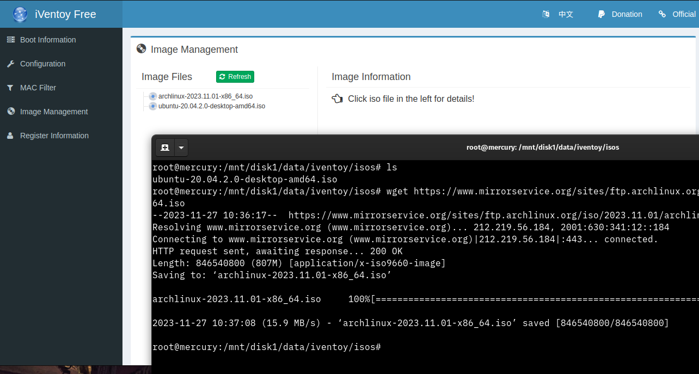
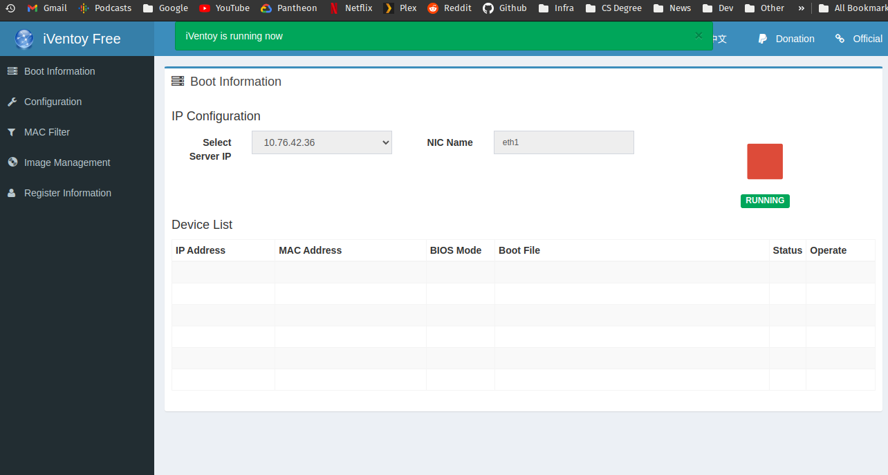
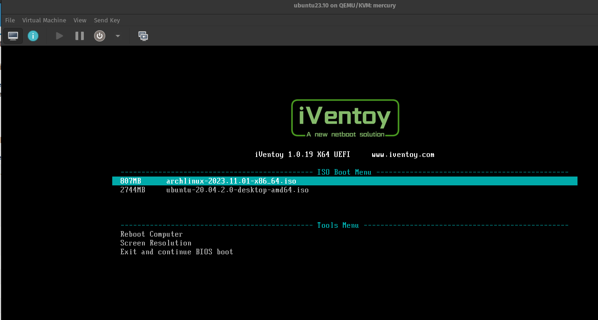

# iVentoy Container

This is a docker container packaging up the iVentoy tool [https://iventoy.com](https://iventoy.com)

The image is based on Debian 12 Bookworm slim version and uses supervisor to launch the process.

Note: The way iVentoy has been developed is really weird, there's no daemon or flags (I can find), so just ignore supervisor warnings for now.

## Usage

It uses sysvfs so the container needs to be ran in privileged mode (not ideal!) and also needs port 69 which is in a privileged range.

### DHCP

By default, I can't find a way of manipulating the configuration at first start.  Unfortunately iVentoy operates it's own DHCP server and will need to be configured to use a external DHCP server in the configuration.

For configuration of various DHCP servers see the [docs/](docs) folder.

### Ports 

The default web admin endpoint port is 26000 and can be hit using a browser pointing to http://<ip>or<localhost>:26000 in Chrome. 

The default internal iVentoy webserver for serving images is 16000 this is configurable in the admin interface documented here [https://iventoy.com/en/doc_http_url.html](https://iventoy.com/en/doc_http_url.html), if changing ensure you forward the correct port number

Port 10809 is Linux Network Block Device - I'm not quite sure what iVentoy uses it for, I'm going to assume to mount EFI or ISO's.

  - 69/69 UDP = TFTP Port
  - 26000/26000 TCP = iVentoy Web GUI Interface
  - 16000/16000 TCP = iVentoy iso & file server
  - 10809/10809 TCP = Block Device

## Volumes

There are a couple of volumes you can mount, the primary is the `iso` folder, which surprisingly containts your iso images you want to boot.

```
docker run -d --privileged -p 69:69 -p 26000:26000 -p 16000:16000 -p 10809:10809 -v /path/to/iso:/iventoy/iso garybowers/iventoy:latest
```

### Persisting Configuration

Another oddity with iVentoy it looks for a /iventoy/data/iventoy.dat file and if that doesn't exist on boot it will fail to load, this causes a issue wanting to persist the /iventoy/data folder.

1. Run iVentoy without the data volume mapped 
```
docker run -d --privileged -p 69:69 -p 26000:26000 -p 16000:16000 -p 10809:10809 -v /path/to/isos:/iventoy/iso garybowers/iventoy:latest --name iventoy-temp
```

copy the contents of the data folder to your persistent storage

```
sudo docker cp iventoy-tmp:/iventoy/data/iventoy.dat /my/local/storage/iventoy/data/
sudo docker cp iventoy-tmp:/iventoy/data/config.dat /my/local/storage/iventoy/data/   <---[Might not exist, skip if not]
sudo docker cp iventoy-tmp:/iventoy/data/mac.db /my/local/storage/iventoy/data/
```

delete the temporary container

```
docker rm iventoy-tmp --force
```

Run iVentoy with the volume for data mounted.

```
docker run -d --privileged -p 69:69 -p 26000:26000 -p 16000:16000 -p 10809:10809 -v /path/to/isos:/iventoy/iso garybowers/iventoy:latest --name iventoy-temp
```

### Configure your DHCP server
See the [docs](docs/) folder for examples.

### Configure iVentoy

Once your container is up and running go to the IP address of your server on port 26000 e.g. http://10.0.0.1:26000

1. Ensure the Server IP is selected correctly, on my docker setup I have a dedicated network with it's own IP for this service.


2. On the configuration menu on the left, If you are using a external DHCP server then ensure the `DHCP Server Mode` is set to `External`


3. Copy a ISO file to your isos folder (locally as set by the volumes above) and goito the `Image Management` menu on the left and hit refresh.



4. Start the server by hitting the bit play button on the `Boot Information` menu screen



5. Test booting.

